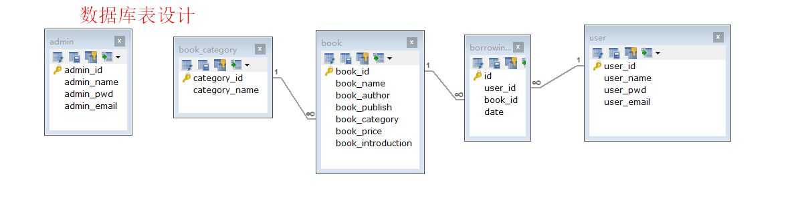

# springboot-libraryManageSystem

> 图书管理系统 ，使用当前最为流行的 SpringBoot 框架，可作为springboot的入门项目练习使用，也可稍加改进做一个毕业设计项目。

## 一、相关技术栈

1. **前端：** Thymeleaf、Layui、Ajax、JQuery
2. **后端** ： springboot , mybatis
3. **开发环境：** IDEA 、SpringBoot 2.3、Maven
4. **数据库**：MySQL 5.7

### 默认用户

当您运行初始脚本后，默认存在以下用户，便于测试：

| 登录名 | 密码   | 用户角色 |
| :---- | :----- | :------ |
| user1  | 123456 | 普通用户 |
| user2  | 123456 | 普通用户 |
| admin  | 123456 |  管理员  |

## 二、主要功能

## 三、数据库表结构设计

## 四 、界面设计

### ①、登录界面

### ②、管理员界面

管理员首页

添加书籍

新建书籍类别

查询书籍

用户管理

借阅信息

管理员信息修改

### ③、用户运行界面

用户登录首页

用户借书记录

## 五、项目部署启动

### ①、部署环境准备

- jdk1.8
- mysql 5.7+
- maven

### ②、具体部署

#### 数据库配置【必须】

